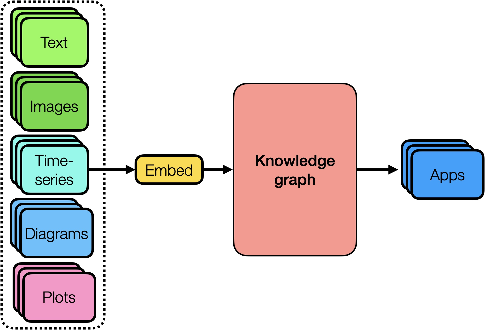

# Kimchi

A collection of tools to process and learn complex documents and extract information from documents, organize knowledge and create knowledge graph.

## pdf-jige

Extract images, tables, text, etc. from PDF documents

## html-jige

Extract data from web pages. Find forms and control them.

## CLIP-jige

Semantic contrastive learning example on small datasets. Dataset: small flicker and also PDF figure extracted with pdf_processor

