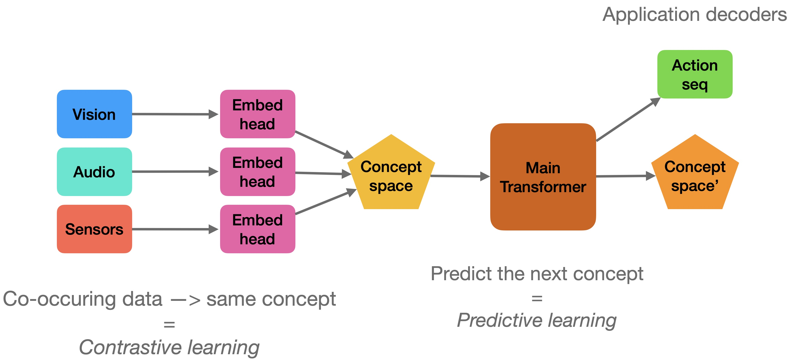
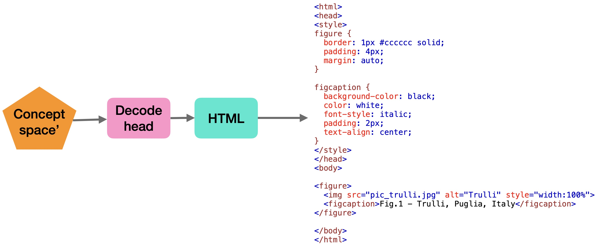

# ABRAIN - web

Hugginface version - using Hugginface VisionEncoderDecoderModel for multi-modal input, with pre-trained encoders




ABRAIN AGI engine applied to web pages. 

This project implements a general knowledge graph learning engine applied to web pages.


### components

1- Input Encoder: vision only (CLIP-like encoder ViT-based) to turn web page into a sequence of image embeddings = "concepts"

2- Main Transformer: learn to predict the next "concept" from a sequence of concepts. In case of documents, predict next right-side block or next bottom block (reading Left to Right and Top to Bottom)

3- Application Decoders: turn concept sequences into actions. This is a classifier for specific application or a 0-shot decoder.


### training

training is in two steps:

1- contractive learning of Input Encoder:

	- take 1 patch of image
	- copy and apply random transforms to second patch
	- use CLIP-like learning to embeded into "concept" space

2- predictive learning of Main Transformer: 

	- predict the next concept


3- learning in the decoder:

The decoder can be trained supervised with a sequence-to-sequence model: input concept sequence, output HTML sequence (with HTML-sensotive tokenization)



Note: images are decoded to web links! This means images will point to web links to similar image on web! 


## Code

dataset is from basic web examples in https://www.w3schools.com/html/html_basic.asp

A few sample of webpage data is in `data/`.

To prepare the dataset run:

`python data.py`

To train (fine-tune) a model run (200 epochs):

`python train.py`

To demo / generate:

`python demo.py `

example demo results:

```
test out:
<! doctype html > < html > < body > < h1 > my first heading < / h1 > < p > my first paragraph. < / p > < / body > < / html >
Ground truth similarity score (0-1): 0.8763250883392226

test out:
<! doctype html > < html > < body > < h1 > my first heading < / h1 > < p > my first paragraph. < / p > < / body > < / html >
Ground truth similarity score (0-1): 0.7823343848580442

test out:
<! doctype html > < html > < body > < h2 > html links < / h2 > < p > html links are defined with the a tag : < / p > < a href = " https : / / www. w3schools. com " > this is a link < / a > < / body > < / html >
Ground truth similarity score (0-1): 0.8316831683168316

test out:
<! doctype html > < html > < body > < h1 > this is heading 1 < / h1 > < h2 > this is heading 2 < / h2 > < h3 > this is heading 3 < / h3 > < h4 > this is heading 4 < / h4 > < h5 > this is heading 5 < / h5 > < h6 > < h6 > this is heading 6 < / h6 > < / html >
Ground truth similarity score (0-1): 0.7849829351535836
```