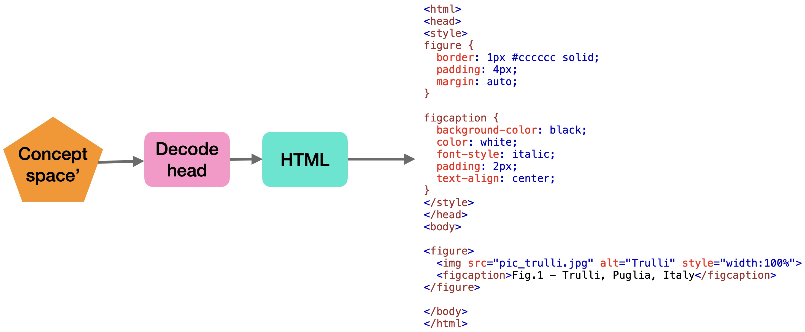

# ABRAIN - web


ABRAIN AGI engine applied to web pages. 

This project implements a general knowledge graph learning engine applied to web pages.


### components

1- Input Encoder: vision only (CLIP-like encoder ViT-based) to turn web page into a sequence of image embeddings = "concepts"

2- Main Transformer: learn to predict the next "concept" from a sequence of concepts. In case of documents, predict next right-side block or next bottom block (reading Left to Right and Top to Bottom)

3- Application Decoders: turn concept sequences into actions. This is a classifier for specific application or a 0-shot decoder.


### training

training is in two steps:

1- contractive learning of Input Encoder:

	- take 1 patch of image
	- copy and apply random transforms to second patch
	- use CLIP-like learning to embeded into "concept" space

2- predictive learning of Main Transformer: 

	- predict the next concept


3- learning in the decoder:

The decoder can be trained supervised with a sequence-to-sequence model: input concept sequence, output HTML sequence (with HTML-sensotive tokenization)



Note: images are decoded to web links! This means images will point to web links to similar image on web! 


## Code

dataset is from basic web examples in https://www.w3schools.com/html/html_basic.asp

A few sample of webpage data is in `data/`.

To prepare the dataset run:

`python data.py`


To train a model run:

`python train.py --char`

to run it in character encoding mode

it can also be run with full BERT vocabolary without the --char option but it is slow.


To show a demo of the trained model:

`python demo.py --char`

Running will return:

```
$ python demo.py 

test:
[CLS] <! doctype html > < html > [PAD] html [CLS] are5 h2 : this [SEP] / [CLS] < < body > < h html > > [SEP] > [CLS] =3 > > the h p images / <. <2s3 < "sch. body is <
Ground truth similarity score (0-1): 0.34421364985163205

test:
[CLS] <! doctype html > < html > [PAD] < p > < 1042 <1 h / < h this is links! com3 html < html doc tag < body htmlsch > " body body > < body / is html p html are " < < < < < " html > < > h > html! h
Ground truth similarity score (0-1): 0.17866004962779156

test:
[CLS] <! doctype html > < html > [PAD] "3 my > < > body = com / sr > > <. html html < = / html < < html2 >type / html " body > < > / > body is h " html [SEP] : <type > heading > / [CLS]2 body. html body / h < body this / < 5 < : > /! : < html h / > [CLS]type p > /3g2 this h > < < > > <type first h > body heading p html
Ground truth similarity score (0-1): 0.15311004784688995

test:
[CLS] <! doctype html > < html > [PAD] p / > < <. tag > 4g <2 body2 first / [CLS]3 < my is body > is / > < / p paragraph < < images >! [CLS] [SEP] > a html > < / my h1. > width is5 > < html links > " < < / p >s < / < h! doc > thistype h < height. > p / < > defined < html < < > [CLS] / h html. < html > < <type paragraph. < > = body < = issch. <s " = h /

```